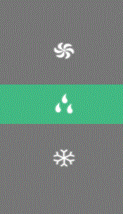

# vue-carousel



## 这是什么？

> 一个滑轮组件，通过一个数组配置出子项，考虑两种使用场景：显示数字或图片，数组内元素为数字或图片url

> 设计了两种控制模式: 

    1. 滑动选择控制，只显示当前的选中元素，滑动时出现左右元素
    2. 滑动+点选控制，显示当前及左右两侧的两个个或多个元素，可滑动调节也可点击直接跳至被点击元素

> 水平竖直的方向可配置

> 在滑动完成后会向父组件派发事件并附带当前选中项的id值，父组件监听使用；并且为了方便直接读取或设置此组件当前状态，还附带了get和set方法供父组件调用

> 组件的显示/隐藏，布局位置，子项高度，字体大小需配置

## 怎么用？

1. 将Carousel.vue文件拷贝到你的工程中

2. 在父组件中引入,配置并使用：
``` html
    <carousel
      ref="carousel1"
      class="carousel-wrapper"
      @currentChange="handleChange"
      :propData="carouselData"
      :options="carouselOptions"
    ></carousel>
```
``` javascript
// 引入组件
import Carousel from './carousel/Carousel';
...
// 在父组件中声明
components: {
  Carousel,
},
data() {
    return {
      // 将data和options分开传入的原因是：在组件使用过程中，样式一般不变，数据可能会变
      carouselData: [1, 2, 3, 4, 5, 6, 7],
      // carouselData: [
      //   'static/images/index_mode_auto.png',
      //   'static/images/index_mode_cool.png',
      //   'static/images/index_mode_dry.png',
      //   'static/images/index_mode_fan.png',
      // ],

      carouselOptions: {
        // 是否显示
        isShow: true,

        // 显示数字还是图片，数字为true，图片为false
        showNumOrImg: true,

        // 水平显示or竖直显示，水平为true，竖直为false
        horizontal: true,

        // 这里设想了2种控制模式：
        // 1.滑动选择控制，是之前使用的方案，只显示当前的选中元素，滑动时出现左右元素
        // 2.滑动+点选控制，以后可能会有这样的需求，显示当前及左右两侧的多个元素，可滑动调节也可点击直接跳至点击元素
        controlMode: 2,
        // 显示3个or全部显示（有时会有只显示当前及左右两边的值(共三个)的需求，在组件内部实现了隐藏效果）,仅在controlMode为1时有设置意义，相当于控制模式1的一种扩展
        threeOrAll: true,
        // 打开/关闭点选，某些场景需要这样设置，点选和滑动有冲突，比较鸡肋的点选功能 -_-|
        clickAble: false,

        // 定位布局配置项：容器的水平位置绝对定位与窗口
        // 组件宽度
        width: '50%',
        marginLeft: '30%',

        // 子项间距,值越小越密集
        spaceBetween: '3rem',
        // 子项容器高度 （似乎这两个值之间存在某种联系，需要一起按比例改变）
        height: '3.5rem',
        // 字体大小
        fontSize: '32px'
        
        // 文字颜色及背景颜色在css中设置即可
      },
    };
  },
  methods: {
    // 手动操作滑动组件改变选择到的id值后会触发此事件
    handleChange: function(args) {
      console.log('当前选择到的id：' + args);
    },

    // get方法，name为区分多个carousel的标志；另一种实现方式：使用vuex来获取carousel组件的selectId属性
    getCarouselId: function(name) {
      let current = this.$refs[name].selectId;
      console.log('当前' + name + '组件被选择的子项id是：' + current);
      return current;
    },

    // set方法，name为区分多个carousel的标志，id为变化到的子项id；实现思路：在父组件中调用子组件自己的setId()方法
    setCarouselId: function(name, id) {
      this.$refs[name].setId(id);
    },
  },
};
```

## 在本工程中可预览效果：
``` bash
# install dependencies
npm install

# serve with hot reload at localhost:8080
npm run dev

# build for production with minification
npm run build

# build for production and view the bundle analyzer report
npm run build --report
```

## 其他
> 还缺少的部分：
1. 子项有边界时的处理方式
2. 一些合适的动画效果
3. 因子项绝对定位于父容器，直接给carousel组件设置css布局属性并不会生效，使用给出的width和marginLeft调整布局位置

> 已知bug：
1. props的默认值设置无效？？原因：对组件传入的options是一个对象，如果传了这个值，默认值就没有被使用，但不能知道对象里面是否少了什么属性，这种情况下少了的那个属性默认值并不能发挥作用

